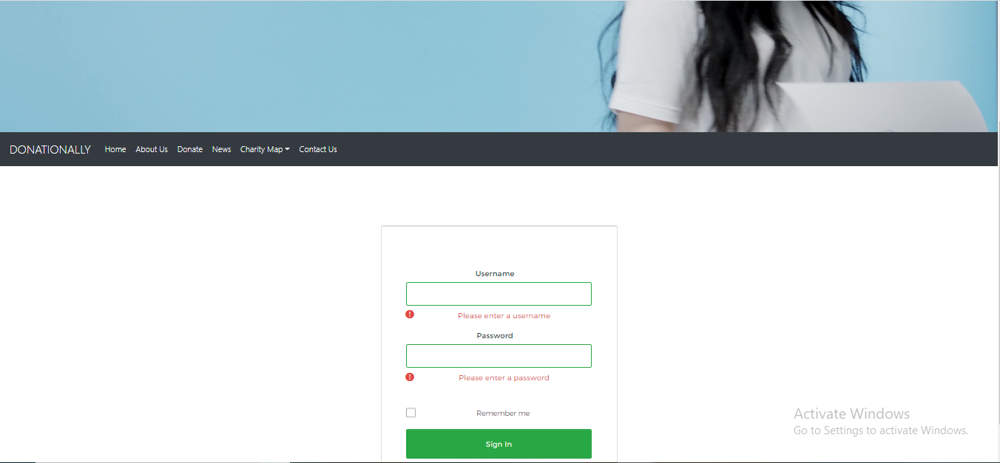
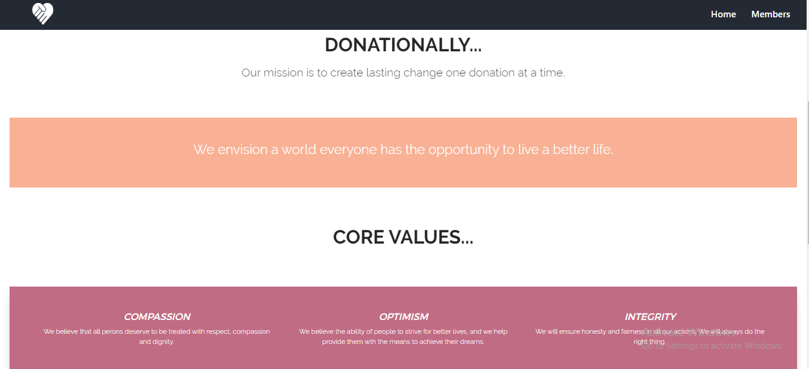
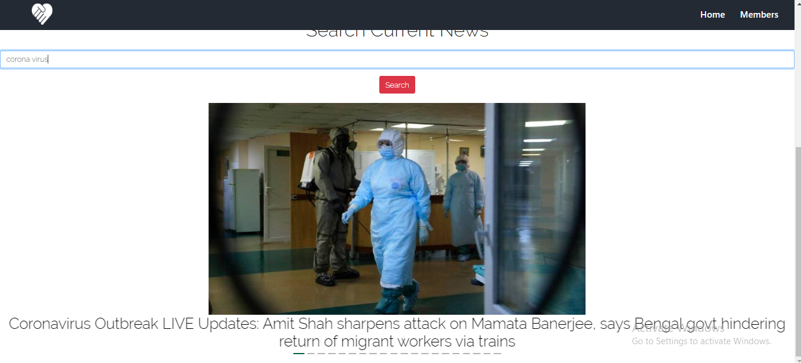
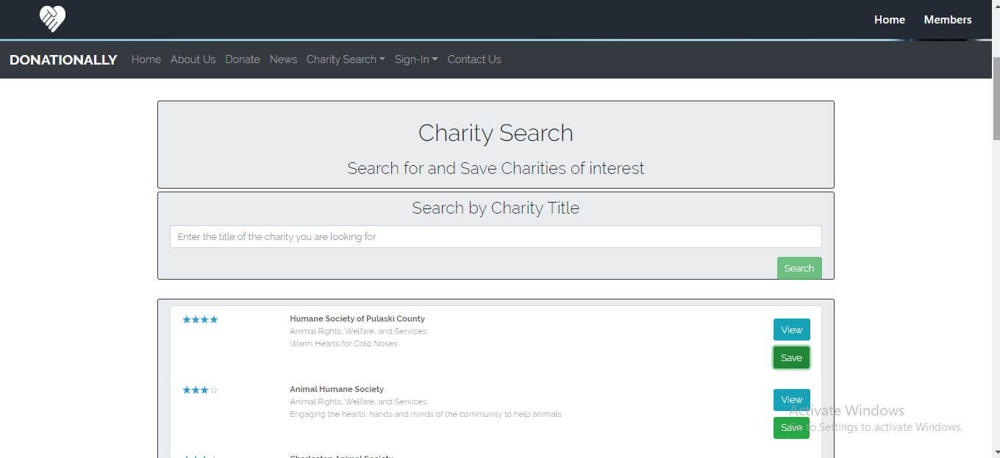
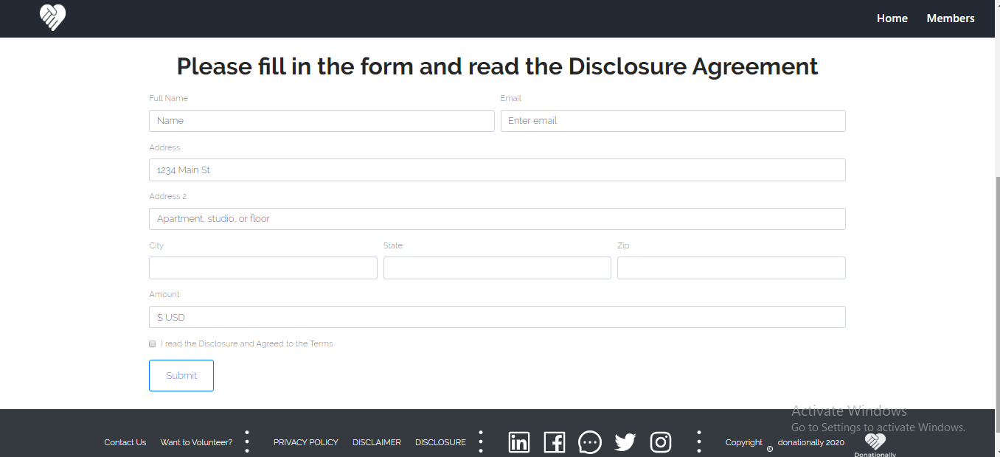
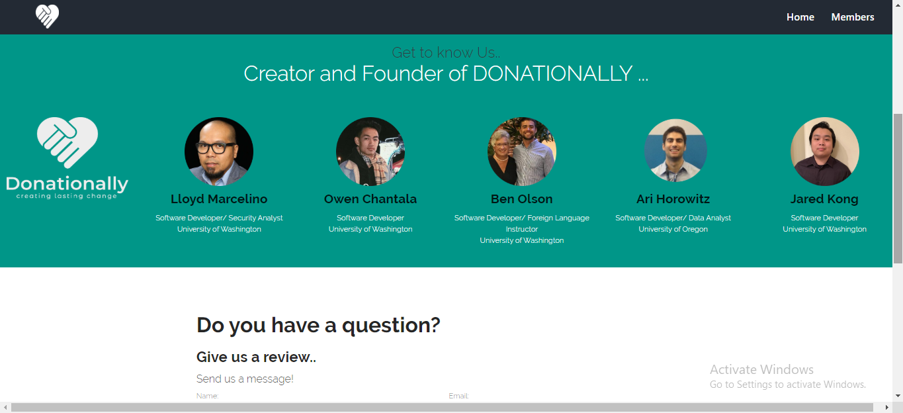
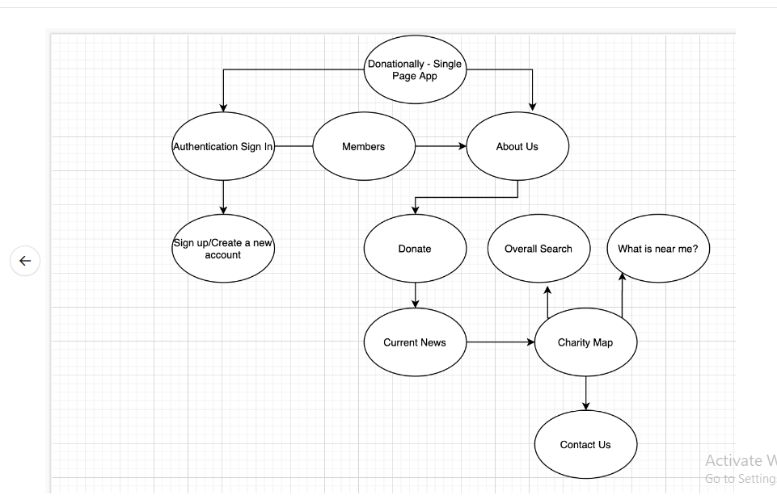

# DonateEase - Donation Application Website 

## Application Interface

This is the main log-in portal of the website. Users are prompted to provide a username and email which creates them an individual account.

The About Us page describes our core values and motivation.

The News page includes a search bar - users can look up worldwide news related to charities.

The Charity Search page provides the user with a worldmap, and the ability to find charities by location.

The Donate page includes a charity search bar, and custom buttons allowing the user to donate an amount of their choosing to their selected charity.

The Contact Us page provides personal information / photos about the creators and founders of Donationally.com. There is also a "Review" section where users can ask questions or give comments.

#### Purpose
- To build a Custom Authentication Experience for Your Application
- Authentication is a crucial part in developing any application. Whether you are developing an internal IT app for your employees, building a portal for your partners, or exposing a set of APIs for developers building apps around your resources, Okta provides the right authentication support for your projects.

- The sign-in experience is one of the most important user experiences any app developer needs to consider. To provide a seamless and attractive, yet secure authentication experience is not a trivial task. Typically, the sign-in logic accompanies other features such as password reset and registration. More importantly, enhanced security in the form of strong and adaptive authentication during the sign-in process is often critical to many implementations.

## General Info

"Donationally" is a non-profit website, allowing users to search for worldwide charities and donate to a personal cause of their choosing. The application incorporates the full "MERN" stack, featuring a Mongo Database that saves user information and "favorited" charities. The "Charity Map" section geolocates the user's position, giving them charities around their area. The "Donate" section of this React project guides users to donate a set or custom amount of money to their selected charity, pairing them up with Paypal. Users are also able to search worldwide news on selected charities through the "News" tab.

## Deployment

-Git clone and download the Repository "Donation-Application-website" from Github onto your local computer
-In your terminal, cd to "Donation-App---Project-3" folder and npm install all of the dependencies
-In terminal run using "npm run start"
-Local browser website will be: localhost:3000
-Additionally, the website (testing phase only) is available on Heroku at: https://ancient-mountain-46633.herokuapp.com/

## Technologies

Project is created with:

- [React library](https://reactjs.org/)
- [HTML](https://developer.mozilla.org/en-US/docs/Web/HTML)
- [CSS](https://developer.mozilla.org/en-US/docs/Web/CSS)
- [JavaScript](https://www.javascript.com/)
- [React-Bootstrap](https://react-bootstrap.github.io/)
- [Mongo](https://www.mongodb.com/)
- [Covid-19 API](https://rapidapi.com/api-sports/api/covid-193)
- [Ant Design](https://ant.design/)
- [AOS](https://www.npmjs.com/package/aos)
- [Formik](https://jaredpalmer.com/formik/docs/api/field)
- [Yup](https://www.npmjs.com/package/yup)

## Future Functionality

- Synchronizing user pay and charity selections with their "Favorites" page
- Tweaks to the layout and Member page
- A blog/chat option where users can talk about their website experience or view charity information

## Summary

- "Donationally" is a charity search and donation application, helping users in multiple ways to stay informed about world events and opportunities to give back to those in need.

## UML

- 

## Database

- This project was completed using MongoDB, populating the database with charity information such as: Charity name, description, rating, and website URL.

## Bugs And Feature Requests

Have a bug or a feature request? Please contact us at "nishantsirohi2307@gmail.com"

## Authors

- Nishant Sirohi

